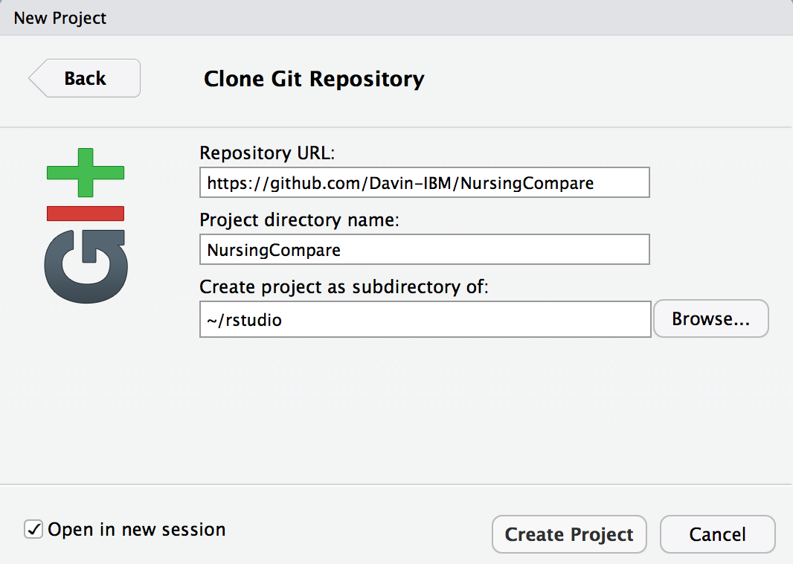
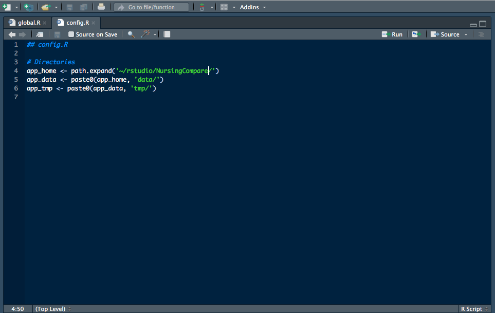
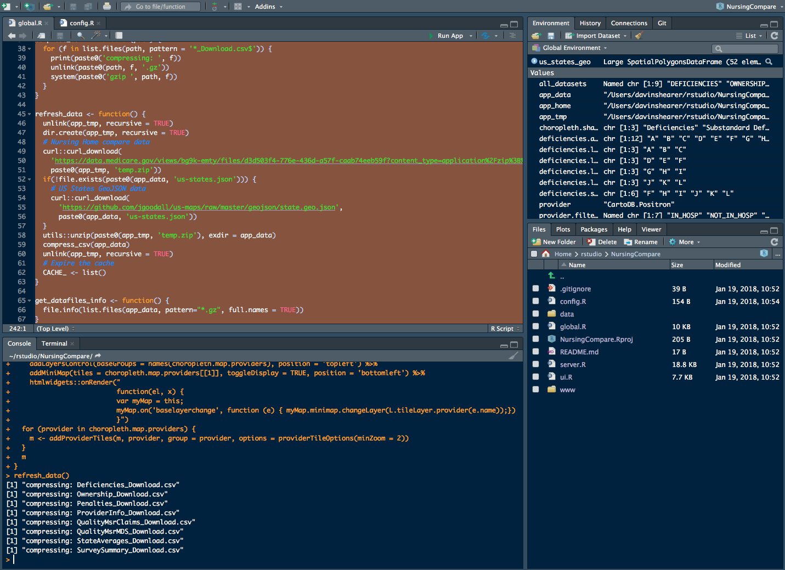
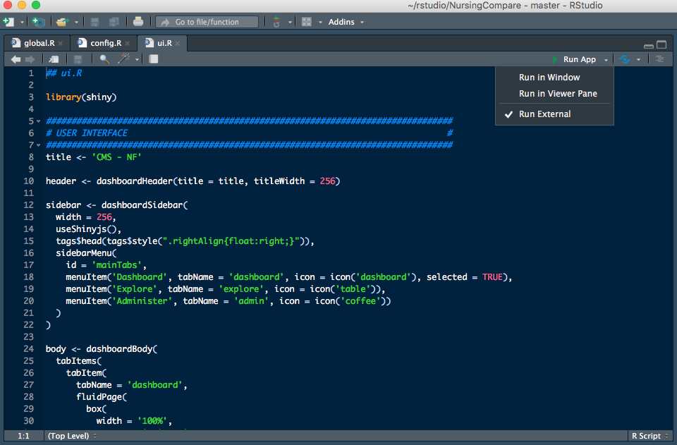
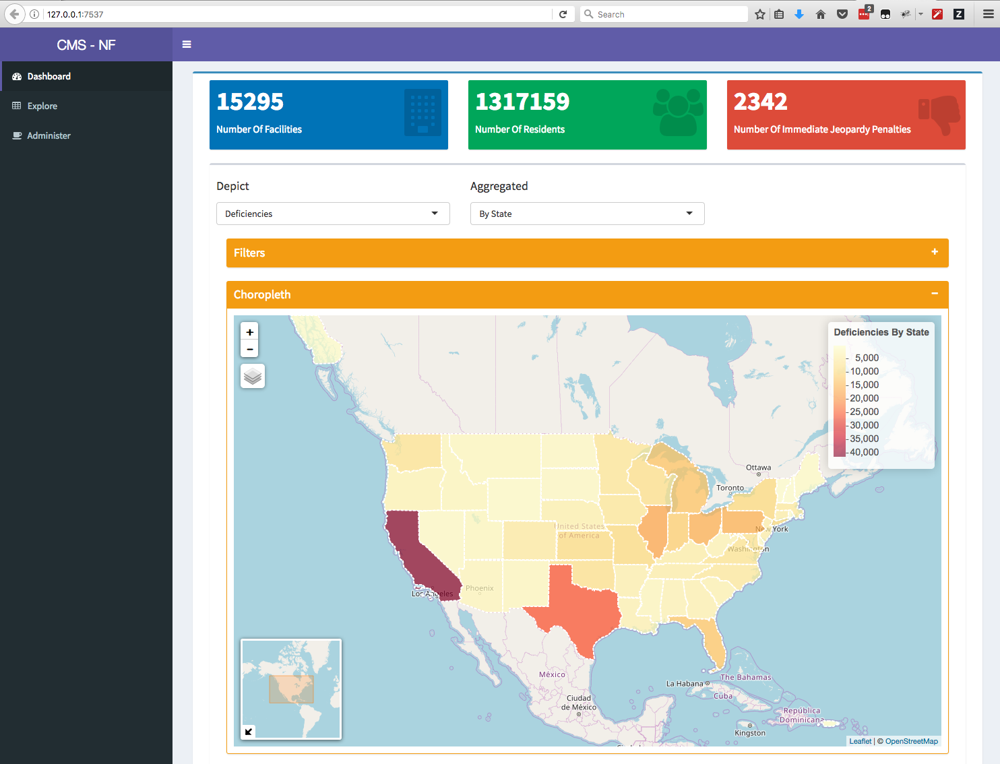

# Nursing Compare

## Setting up the environment and running the application

There are many available options.  There is the Data Science Experience (DSX) in IBM's Cloud, DSX Local, DSX Desktop, or the RStudio application.

In RStudio, go to File -> New Project, then select Version Control, then Git.  Now enter `https://github.com/Davin-IBM/NursingCompare` as the Repository URL, `NursingCompare` as the Project directory name and select where to put this folder (I put mine in `~/rstudio`).

In the RStudio Files pane (in the lower right), click on `config.R` and if you put the project in a different directory than `~/rstudio/NursingCompare`, in the code editor, edit the `app_home` variable to match your environment.

Next, in the Files pane, click on `global.R`, select all the text in the code editor (CTRL-a for Windows / Linux, CMD-a for Mac) and executue the highlighed code by hitting CTRL-ENTER (or CMD-ENTER on Mac).  Give that a few seconds to run, then click in the Console window on the bottom left and at the `>` prompt, type `refresh_data()` to download and process the CMS Nursing Compare data from the data.medicare.gov website.

Once the data has been downloaded and processed (you'll know this becuase the command prompt will re-appear int he Console window), we're ready to run the application.  In the top right of the code editor you'll find the `Run App` button, but before we press that, go to the littke white triangle to the right of `Run App` and select `Run External` (this will open the application using your default web browser instead of an RStudio window).  Now click on `Run App`.

After loading up some data (which takes several seconds), the application ought to appear in your browser.

Congratulations!  You've got the application running.
